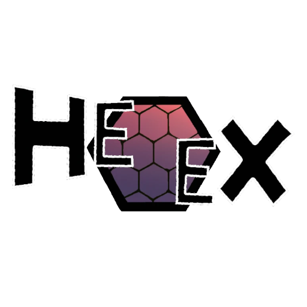

# HexHex
HexHex is a client mod for [Minecraft](https://www.minecraft.net/) using the [Fabric Mod Loader](https://fabricmc.net/).
It has no dependencies, not even [Fabric API](https://modrinth.com/mod/fabric-api).
Fully compatible with [Sodium](https://modrinth.com/mod/sodium), however NightVision might not work with some shaders.

## Features
A button looking like a fire charge is added to the player inventory screen, which when pressed opens a screen to toggle and configure the following features:

|      Name      |              Description              |
| :------------: | :-----------------------------------: |
| CreativeFlight |  Allows flying like in creative mode  |
|  EntityFlight  | Allows flying with rideable entities  |
|  NightVision   | Renders everything at full brightness |
|     NoFall     |        Negates most falldamage        |
|     X-Ray      |    Renders only whitelisted blocks    |

## License
HexHex - Minecraft mod gifting the player unique abilities that are definitly not exploits 
Copyright (C) 2023 Elias*

This program is free software: you can redistribute it and/or modify
it under the terms of the GNU Lesser General Public License as published by
the Free Software Foundation, either version 3 of the License, or
any later version.

This program is distributed in the hope that it will be useful,
but WITHOUT ANY WARRANTY; without even the implied warranty of
MERCHANTABILITY or FITNESS FOR A PARTICULAR PURPOSE. See the
GNU General Public License for more details.

You should have received a copy of the GNU Lesser General Public License
along with this program. If not, see <https://www.gnu.org/licenses/>.
